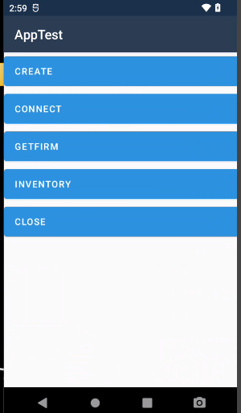

# rodinbell-handhelp-xamarin
rodinbell orca30-handhelp  xamarin

## 1. init a Reader : 
        mxreaderHelper.CreateReaderHub(nameid);

## 2. connect Reader :  TRY TO CAHANGE THE SEERIAL PORT
        JObject jobj = new JObject
        {
                {"method", "connectDevice"},
                {"params",
                        new JObject{
                                {"param1", "dev/ttyAS3"},
                        }
                }
        };
        var res = mxreaderHelper.CallReaderHubUhf(nameid, connectstr);

## 3. get firmware info :
        JObject jobj = new JObject
        {
            {"method", "getFirmwareVersion"},
        };
        var res = mxreaderHelper.CallReaderHubUhf(nameid, getfirmstr);

## 4. inventory : 
        JObject jobj = new JObject
        {
            {"method", "customInventory"},
        };
        var res = mxreaderHelper.CallReaderHubUhf(nameid, inventorystr);

## 5. close : 
        mxreaderHelper.DestroyReaderHub(nameid);

              
